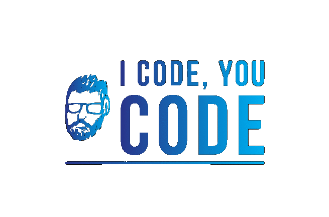

# I Code You Code

<!--  -->


This project is a real-time collaborative code editor with a chat feature. It allows multiple users to join a room, edit code together, and communicate through a chat interface.

## Features

- **Real-time Code Editing:** Collaborate with others on code editing in real-time using a shared code editor.
- **Chat Functionality:** Communicate with other users in the same room through a real-time chat feature.
- **Change Theme:** Switch between light and dark themes for the editor.
- **Copy Room ID:** Easily copy the room ID to share with others for collaboration.
- **Leave Room:** Leave the current room and return to the main page.

## Technologies Used

- **React:** Frontend framework for building the user interface.
- **Socket.IO:** Enables real-time bidirectional communication between clients and the server.
- **Express:** Node.js web application framework used for the server.
- **Moment.js:** Library for formatting and parsing dates and times.

## Project Structure

The project is structured as follows:

- `src/`: Contains the frontend React components.
- `server.js`: Express server code for handling WebSocket connections.

## Getting Started

1. Clone the repository:

   ```bash
   git clone https://github.com/no-eyed/I-Code-You-Code-Fullstack.git

2. Install dependencies:

    ```bash
    npm install

3. Run the development server:

    ```bash
    npm start

4. Start the backend:

    ```bash
    node server.js